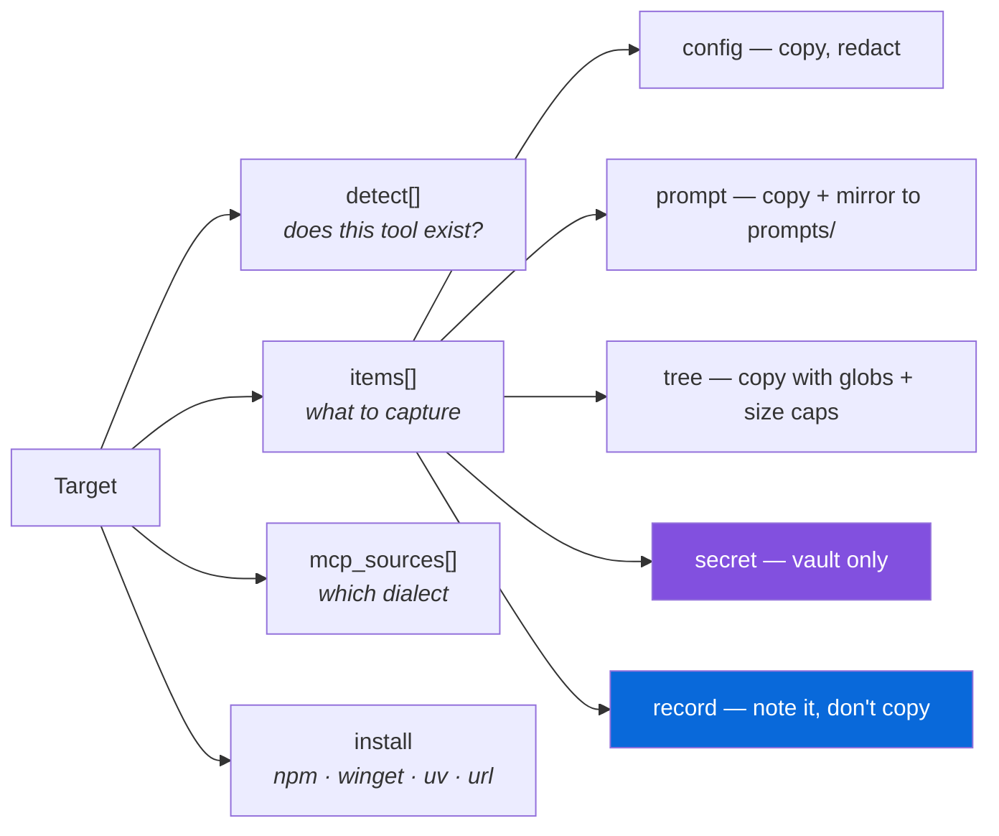
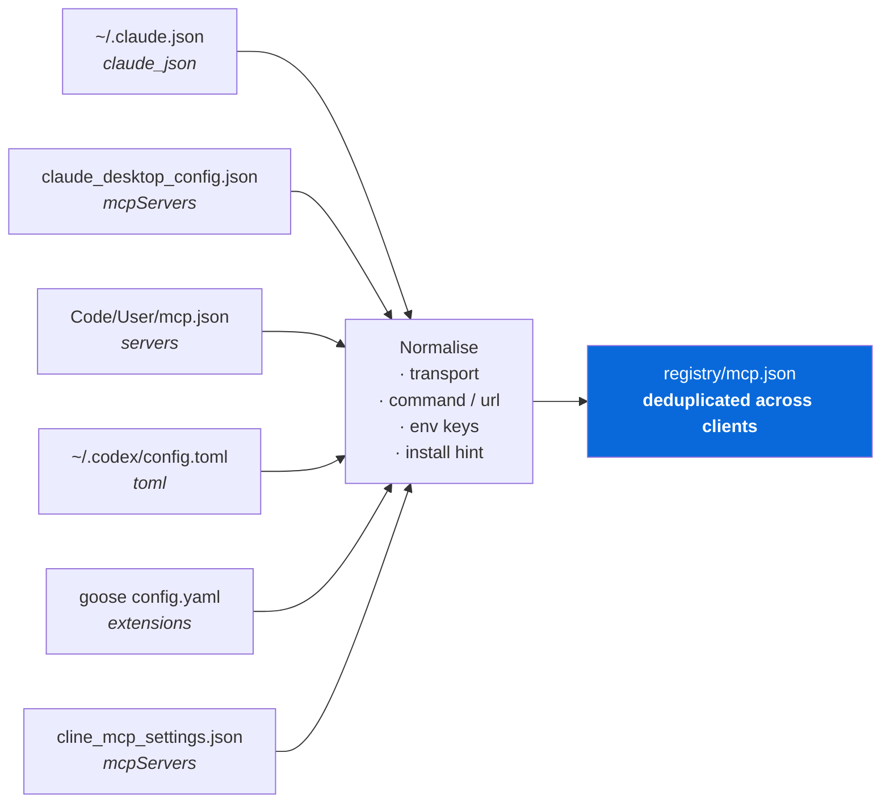
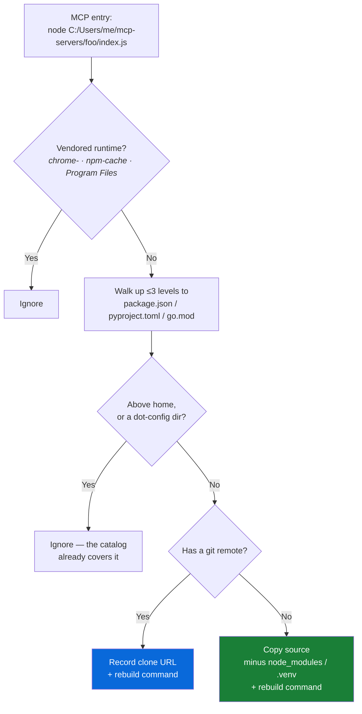

# Features

Complete reference for what Windows AI Backup captures, how it decides, and what
restore does with each piece.

---

## 1. Discovery

The catalog in [`waib/catalog.py`](waib/catalog.py) declares 25 targets. Each names
the paths that prove the tool is installed, the artifacts worth preserving, the MCP
config dialects it uses, and how to obtain the tool again.



### Supported tools

| Category | Tools |
|---|---|
| **Agent CLIs** | Claude Code, OpenAI Codex, Gemini CLI, GitHub Copilot CLI, Cline, Aider, OpenCode, Goose, Amazon Q Developer |
| **AI IDEs** | Cursor, VS Code, VS Code Insiders, Windsurf, Google Antigravity, Zed, JetBrains Junie, Continue |
| **Local inference** | Ollama, LM Studio |
| **Desktop apps** | Claude Desktop |
| **MCP** | Custom MCP server workspace, Serena |
| **Platforms & add-ons** | OpenClaw, claude-mem, portable `.agent` / `.agents` / `AGENTS.md` |

### Adding a tool

```python
MY_TOOL = Target(
    id="my-tool",
    name="My AI Tool",
    category="Agent CLI",
    detect=("~/.mytool",),
    install=Install(npm="my-tool", docs="https://…"),
    items=(
        Item("~/.mytool/config.json", "config", "Model and provider settings"),
        Item("~/.mytool/PROMPT.md",   "prompt", "Global master prompt"),
        Item("~/.mytool/skills",      "tree",   include=("**/*.md",)),
        Item("~/.mytool/auth.json",   "secret", "API credentials"),
        Item("~/.mytool/cache",       "record", "Re-downloadable"),
    ),
    mcp_sources=(McpSource("~/.mytool/config.json", "mcp_servers", "My AI Tool"),),
)
```

Append it to `TARGETS`. Scanner, collectors, inventory and restore pick it up
automatically — no other file changes.

---

## 2. Master prompts and instructions

The reason the tool exists. Everything a model reads before it reads your question.

| What | Where it comes from |
|---|---|
| Global master prompts | `~/.claude/CLAUDE.md`, `~/CLAUDE.md`, `~/.codex/AGENTS.md`, `~/.gemini/GEMINI.md`, `~/AGENTS.md` |
| Rule sets | `~/.claude/rules/**`, `~/.cursor/rules/**`, `~/.antigravity/rules/**`, `~/.continue/rules/**`, `~/.agent/rules/**` |
| Memories | `~/.claude/projects/*/memory/**`, `~/.codeium/windsurf/memories/**` |
| Copilot instructions | `%APPDATA%/Code/User/prompts/**` |
| Windsurf global rules | `~/.codeium/windsurf/global_rules.md` |

Every one is copied verbatim **and** mirrored into `prompts/` in the backup, so you can
read your whole prompt stack in one directory without digging through the mirrored tree.

---

## 3. MCP servers

Six clients, six dialects, one registry.



Each entry records the transport, the command line or URL, which env keys it needs
(names only — values are redacted), every client that uses it, and the one-liner that
provisions it again:

| Command shape | Reinstall hint |
|---|---|
| `npx -y firecrawl-mcp` | `npx -y firecrawl-mcp` |
| `C:\…\uvx.exe serena-agent` | `uvx serena-agent` |
| `uvx --from git+https://… entry` | `uvx --from git+https://… entry` |
| `docker run … ghcr.io/x/y` | `docker pull ghcr.io/x/y` |
| `python.exe -m mcp_india_stack` | `pip install mcp-india-stack` |
| `node C:\srv\index.js` | source backed up, run its rebuild command |
| `https://…/mcp` | remote endpoint — no install needed |

The same server declared in three clients appears once, listing all three.

---

## 4. Custom MCP servers

An MCP entry pointing at a local script references code that exists on no registry.
Lose the folder, lose the server.



Rebuild commands are detected from the lockfile actually present:
`pnpm install` · `yarn install` · `npm ci` · `npm install` · `uv sync` ·
`pip install -r requirements.txt` · `pip install -e .` · `go build ./...` · `cargo build --release`

The whole `~/mcp-servers` workspace is also swept, so servers you wrote but haven't
wired up yet survive too.

---

## 5. Skills, agents, commands, plugins

| Artifact | Handling |
|---|---|
| Skills (`~/.claude/skills`, `~/.agents/skills`, `~/.openclaw/skills`, …) | Copied — hand-authored |
| Agents (`~/.claude/agents`, `~/.cursor/agents`) | Copied, indexed by name and description |
| Slash commands (`~/.claude/commands`, `~/.gemini/commands`) | Copied |
| Plugins | Recorded by name + marketplace |
| Marketplaces | Recorded by source (`github` repo, `git` url, local `directory`) |

Plugin **payloads** are not copied — a plugin cache is hundreds of megabytes that
`claude plugin install` re-fetches. Restore emits:

```powershell
claude plugin marketplace add owner/repo
claude plugin install plugin-name@marketplace
```

---

## 6. Models

**Cloud selections** — the model each client is set to, plus configured providers —
are copied from settings.

**Local weights** are recorded, never copied:

| Runtime | Recorded | Restore |
|---|---|---|
| Ollama | Model reference + approximate size, read from manifests | `ollama pull <model>` |
| LM Studio | Repo id per `.gguf` / `.safetensors` | `lms get <repo>` |

VS Code-family `chatLanguageModels.json` registrations are captured as-is.

---

## 7. Packages, applications, extensions

| Source | Detected via | Restore |
|---|---|---|
| npm globals | `npm ls -g --json` | `npm install -g <pkg>@latest` |
| uv tools | `%APPDATA%/uv/tools` | `uv tool install <pkg>` |
| pipx | `~/pipx/venvs` | `pipx install <pkg>` |
| bun globals | `~/.bun/install/global/node_modules` | `bun add -g <pkg>` |
| winget apps | `winget list`, filtered to AI | `winget install --id <id> -e` |
| Go binaries | `~/go/bin` | recorded for manual reinstall |
| Desktop apps | `%LOCALAPPDATA%/Programs`, `Program Files` | vendor download link |
| IDE extensions | `extensions.json` index, or folder manifests | `code --install-extension <id>` |

Every hand-installed global is restored, not just the ones that look AI-related —
guessing which npm CLI is "AI enough" loses tools, and reinstalling one you already
wanted costs nothing. Classification only drives the report.

The AI classifier uses word boundaries for short tokens, so `Windows Mail` and
`Mozilla Maintenance Service` do not get filed as AI software.

---

## 8. Identity

Non-secret account information needed to sign back in:

- Claude Code: `oauthAccount`, `userID`, `machineID`, install method, subscription flag
- Gemini CLI: active Google account, installation id
- Codex CLI: account id, email, plan
- Copilot CLI, Cursor, LM Studio: user / team ids
- Git: `user.name`, `user.email`, `gh auth status`

Access tokens, refresh tokens and API keys are stripped from these records
regardless of where they appear.

---

## 9. Environment variables

Persistent user variables (`HKCU\Environment`) are read separately from the session
environment, because only the persistent ones should be recreated. Names matching AI
providers, MCP, and vector stores are captured; ephemeral session variables
(`CLAUDE_CODE_SESSION_ID`, `CLAUDECODE`, …) are excluded by name.

Non-secret values are stored inline. Secret values go to the vault, and restore emits
a `restore-secret-env.ps1` that recreates them.

---

## 10. Safety

### Layer 1 — structured redaction

Applied to anything that parses as JSON, JSONC, TOML or YAML.

| Signal | Example |
|---|---|
| Key name | `api_key`, `token`, `client_secret`, `KEY`, `apiKey` |
| Value shape | `sk-…`, `sk-ant-…`, `ghp_…`, `AIza…`, `xoxb-…`, `hf_…`, `AKIA…`, `sbp_…`, `gsk_…`, `pplx-…`, `tvly-…`, `nvapi-…`, `r8_…`, `glpat-…`, JWTs |
| Argument position | `["--access-token", "sbp_live…"]`, `--api-key=…` |

A bare 40-character alphanumeric run is deliberately **not** treated as a secret —
git commit SHAs, content hashes and machine ids all take that shape.

### Layer 2 — text scrubbing

Every file written into the backup gets a second pass that catches what parsing can't:
a key hardcoded in a `.js` constant, a token embedded inside a longer string, a config
whose dialect the parser rejected. Placeholders (`your-api-key-here`, `${GITHUB_TOKEN}`,
`process.env.X`) are left intact.

### Layer 3 — filename rules

Anything named like a credential store is diverted to the vault on sight, whatever the
catalog says: `.credentials.json`, `auth.json`, `secrets.json`, `oauth_creds.json`,
`.env*`, `*.pem`, `*.key`, `id_ed25519`, `.netrc`, `.npmrc`, `.pgpass`.

### The vault

AES-256-GCM, key derived with scrypt (N=2¹⁵, r=8, p=1), random salt and nonce per seal,
magic bytes as additional authenticated data.

**Not DPAPI** — DPAPI keys are bound to the machine and user profile, so a DPAPI-sealed
vault is unreadable after exactly the reinstall this tool exists to survive.

Without `--secrets`, credentials are neither copied nor stored anywhere.

---

## 11. Reporting

`INVENTORY.md` answers "what did I have, and where was it?" without needing the tool:

- Every master prompt with its original path and its path in the backup
- Every MCP server: transport, command, clients, reinstall hint
- Every skill, agent, command with owner and description
- Every plugin, marketplace and source
- Every model, package, extension, account, environment variable
- **Recorded but not copied** — location, size, and why

`INVENTORY.json` is the same data for scripts. `registry/*.json` splits it by domain.

---

## 12. Engineering details

**Pruned walks.** `Path.rglob` descends into `node_modules` before filters apply.
`walk.py` prunes at directory level — a 103-second scan became 24 seconds.

**Long paths.** Extension and plugin trees exceed `MAX_PATH`; `copyio.py` uses
extended-length `\\?\` prefixes for both copy and `mkdir`.

**Locked files.** Running AI tools hold configs open. A failed `CopyFile2` falls back
to a plain read-and-write, and a genuinely unreadable file becomes a reported skip
rather than a crashed backup.

**Portable paths.** `%USERPROFILE%`, `%APPDATA%`, `%LOCALAPPDATA%` placeholders mean a
backup taken as one user restores as another. Round-tripping is covered by tests.

**Immutability.** Catalog entries and scan results are frozen dataclasses; redaction
returns new objects rather than mutating input.

**Size discipline.** Per-file and per-tree caps with the reason recorded when a cap
is hit, so nothing disappears silently.

---

## 13. Test coverage

79 tests, run before every build by `build.ps1`.

| Area | What's proven |
|---|---|
| Paths | Placeholder round-trip, most-specific-root wins, unknown roots handled |
| Redaction | Key / value / position detection, no input mutation, no false positives on SHAs and UUIDs |
| Scrubbing | Hardcoded keys, embedded tokens, placeholders preserved, idempotence, binary untouched |
| Vault | Round-trip, wrong passphrase rejected, no plaintext in ciphertext, fresh nonce per seal |
| MCP | All six dialects, project-scoped servers, install-hint reconstruction |
| Collection | Include / exclude globs, size caps, secret diversion, prompt mirroring |
| Round-trip | Backup produces every artifact, inventory is self-consistent, every archived file exists, restore writes into a sandboxed profile |
