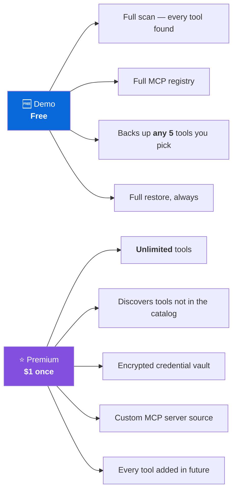
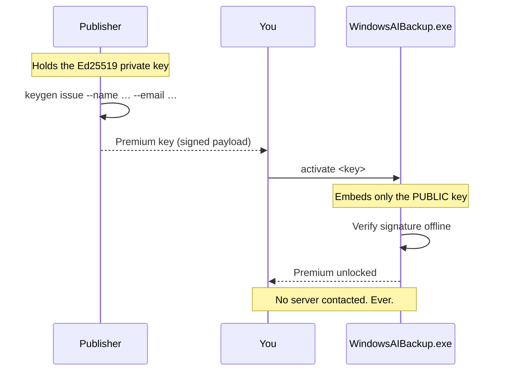

# Demo and Premium

Windows AI Backup ships as one executable. Without a license it runs in **Demo**;
a Premium key removes the tool limit. No account, no subscription, no server calls.



## Side by side

| | Demo (free) | Premium ($1 once) |
|---|:---:|:---:|
| `scan` — see every AI tool on the PC | ✅ full | ✅ full |
| `catalog` — browse all known tools | ✅ full | ✅ full |
| `mcp` — unified MCP server registry | ✅ full | ✅ full |
| `discover` — list uncatalogued tools | ✅ full | ✅ full |
| **Tools captured in a backup** | **any 5 you choose** | **unlimited** |
| Master prompts, rules, memories | ✅ for those 5 | ✅ all |
| Skills, agents, slash commands | ✅ for those 5 | ✅ all |
| Packages, extensions, models, identity, env | ✅ | ✅ |
| `restore` — put a backup back | ✅ **always** | ✅ |
| Encrypted credential vault (`--secrets`) | — | ✅ |
| Capture uncatalogued tools (`--discover`) | — | ✅ |
| Custom MCP server source captured | listed only | ✅ copied + rebuilt |
| Reports without a demo notice | — | ✅ |
| Tools added in future versions | — | ✅ |

### Choosing your five

Demo does not pick for you. Any five tools in the catalog, your choice:

```powershell
WindowsAIBackup.exe catalog                    # see every id
WindowsAIBackup.exe backup --tools claude-code,cursor,ollama,vscode,windsurf
```

Run it without `--tools` and it picks the five most broadly useful tools that are
actually installed, so the first run still lands on something worth having.

## Three things that are never gated

**Scanning.** You see the complete picture — every tool, every MCP server, every
uncatalogued directory — before deciding whether to pay. A demo that hides what it
found would be asking you to buy blind.

**Discovery reporting.** `discover` lists everything it finds for free. Premium is
needed to *capture* those tools, not to learn they exist.

**Restore.** A backup you already made stays restorable in any edition, forever.
Holding your own configuration hostage would be indefensible, so `restore` and
`unlock` check no license at all.

## Buying

> **⚠️ Publisher note — replace this section before shipping.**
> Payment is not wired up yet. Add your own checkout link (Gumroad, Lemon Squeezy,
> Razorpay, Ko-fi, Stripe Payment Link) here, then mint a key per order with
> `python tools/keygen.py issue --name "…" --email "…" --order "…"`.

1. Pay $1 at the checkout link above.
2. You receive a Premium key by email.
3. Activate it:

```powershell
WindowsAIBackup.exe activate <your-key>
```

Or run `WindowsAIBackup.exe` and choose **8 — Activate**.

Check your edition any time:

```powershell
WindowsAIBackup.exe license
```

## How licensing works

A Premium key is a **signed payload**, not a shared password.



The key carries your name, email, order reference and issue date, signed with
Ed25519. The executable holds only the public half, so it verifies your key
without a network call — the tool reads your AI configuration, and it should
never need to talk to anyone about it.

**An honest limit:** at $1, the signature stops casual key-sharing, not a
determined person with a debugger. That is a deliberate trade. Staying fully
offline matters more here than unbreakable enforcement, and the price is set
where paying is easier than not.

## Refunds

It's a dollar, and the Demo shows you exactly what the tool finds before you buy.
If Premium doesn't do what this page says, ask and you get your dollar back.

## For the publisher

```powershell
python tools/keygen.py init                 # once — creates the keypair
python tools/keygen.py issue --name "Jane Doe" --email jane@example.com --order 1234
python tools/keygen.py verify <key>
```

`tools/publisher_private.key` is gitignored. Back it up somewhere safe — losing it
means every key you have issued can no longer be reissued, and replacing it
invalidates all existing keys.

### Growing the catalog

The catalog is JSON, not code. Adding tools does not require a new build:

```powershell
python tools/build_catalog.py        # regenerate waib/data/catalog.d/*.json
WindowsAIBackup.exe catalog --validate
```

Ship new entries either in the next release or as a drop-in file users place in
`%APPDATA%\WindowsAIBackup\catalog\`. Users can add their own in-house tools in
`%APPDATA%\WindowsAIBackup\catalog.local\` without waiting for you.
