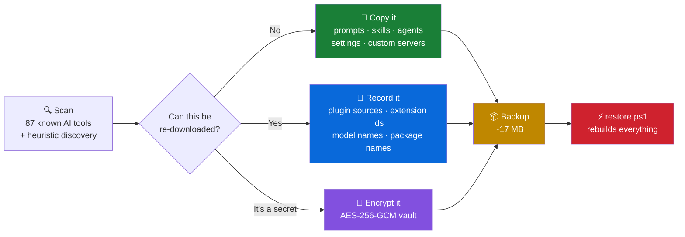
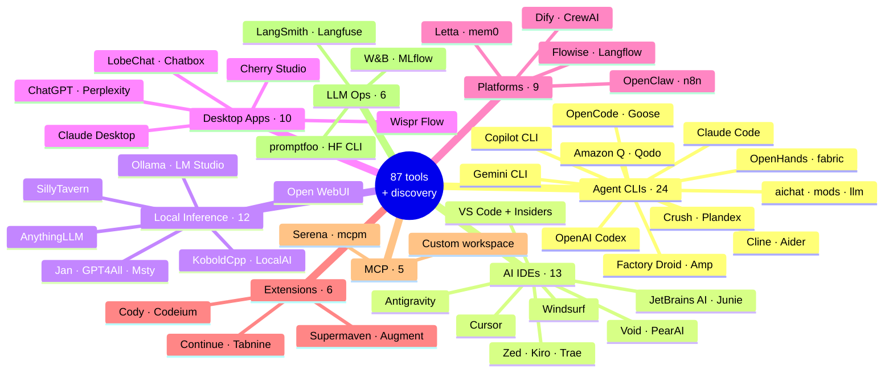
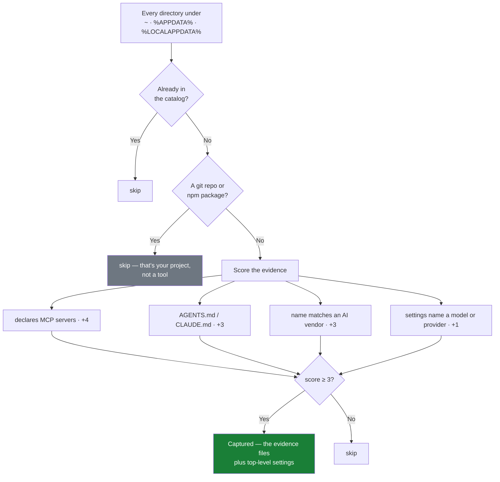
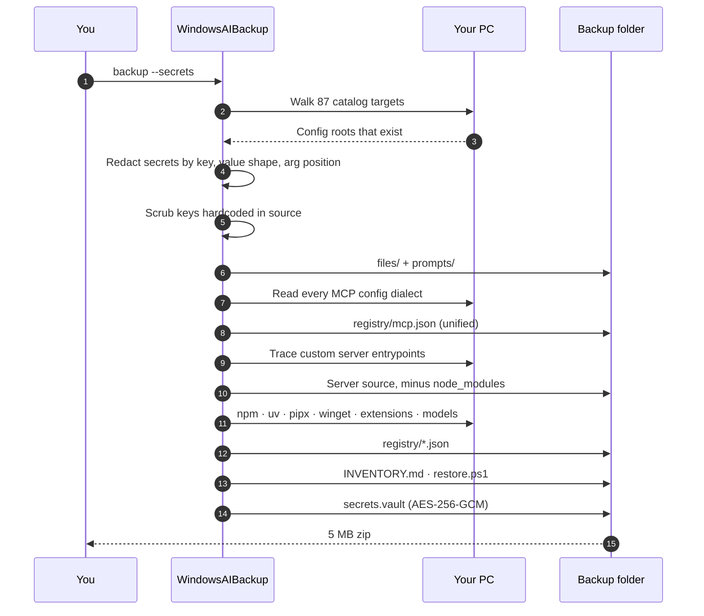
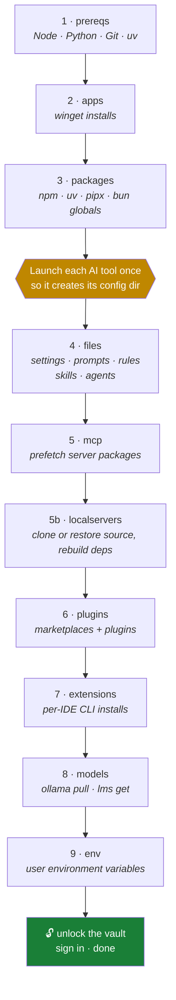
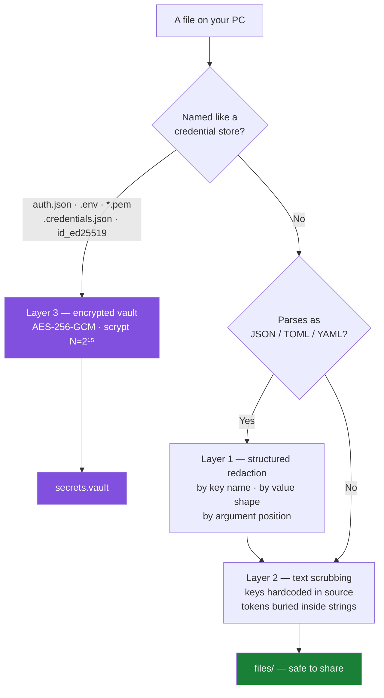
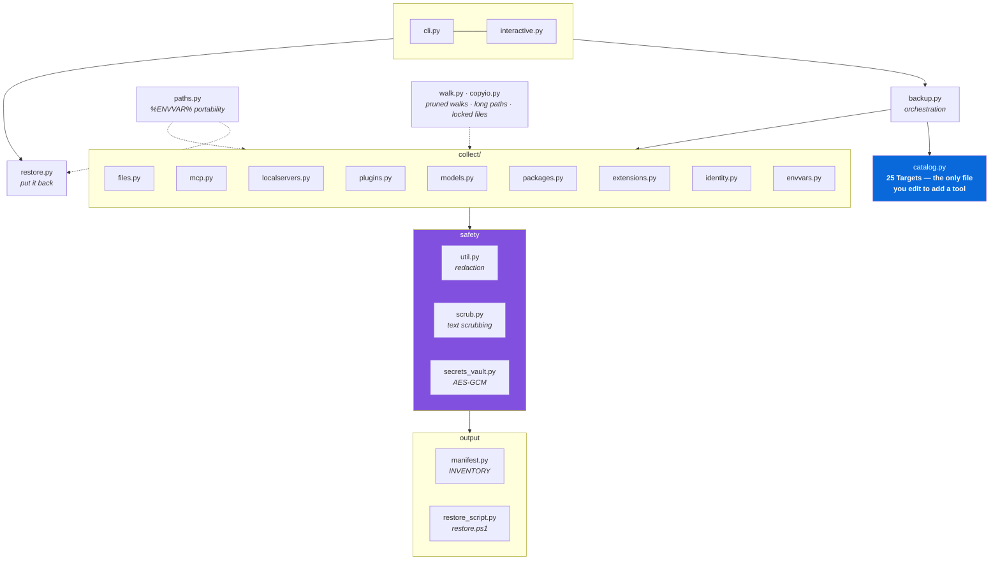

<div align="center">

# Windows AI Backup

**Reinstall Windows without losing your AI setup.**

One executable that finds every AI tool on a Windows PC, records what it is and where it lives,
backs up the parts that cannot be re-downloaded, and generates a script that rebuilds
the whole setup on a fresh machine.

[](https://github.com/srksourabh/windows-ai-backup/releases/latest/download/WindowsAIBackup.exe)
[](PRICING.md)
[](LICENSE)
[](waib/data/catalog.d)
[](tests)

*Built by [Sourabh Bhaumik](https://github.com/srksourabh)*

</div>

---

## The problem

Your AI setup is scattered across two dozen directories. Master prompts in `~/.claude/CLAUDE.md`,
MCP servers in six different config dialects, skills you wrote by hand, agent definitions,
rules, memories, API keys, model choices, IDE extensions. A Windows reinstall erases all of it.

Copying `C:\Users\you` wholesale doesn't work either — it's gigabytes of plugin caches,
`node_modules`, session transcripts and model weights that all re-download in minutes anyway.

## The answer

Know the difference between **what exists nowhere else** and **what the internet still has**.



**~2 GB of config directories become a 5 MB zip.** Nothing that matters is lost.

---

## Quick start

```powershell
# Download WindowsAIBackup.exe from Releases, then:

.\WindowsAIBackup.exe                    # interactive menu
.\WindowsAIBackup.exe scan               # what's on this PC
.\WindowsAIBackup.exe backup --secrets   # full backup, credentials encrypted
```

After the reinstall:

```powershell
Expand-Archive .\WindowsAIBackup_*.zip -DestinationPath .\restore
cd .\restore
.\restore.ps1 -WhatIf     # preview every action
.\restore.ps1             # rebuild the machine
```

No Python, no dependencies, no installer. One 12 MB file.

---

## Demo and Premium

The same executable runs in **Demo** until you activate a key. Full details in [PRICING.md](PRICING.md).

| | Demo (free) | Premium — **$1 once** |
|---|:---:|:---:|
| Scan, catalog, MCP registry, discovery report | ✅ full | ✅ full |
| **Tools captured in a backup** | **any 5 you pick** | **unlimited** |
| Restore a backup | ✅ **always** | ✅ |
| Encrypted credential vault | — | ✅ |
| Capture uncatalogued tools | — | ✅ |
| Custom MCP server source | listed only | ✅ copied |
| Future tools | — | ✅ |

Demo does not choose for you — pick any five:

```powershell
WindowsAIBackup.exe catalog                                    # every tool id
WindowsAIBackup.exe backup --tools claude-code,cursor,ollama,vscode,windsurf
WindowsAIBackup.exe license                                    # what Premium adds
WindowsAIBackup.exe activate <key>                             # unlock
```

**Scanning, discovery and restore are never gated.** You see everything the tool
finds before deciding to pay, and a backup you already made stays restorable
forever, in any edition.

---

## What it captures

| Category | Handling |
|---|---|
| **Master prompts** — `CLAUDE.md`, `AGENTS.md`, `GEMINI.md`, global rules, memories | Copied, and mirrored into `prompts/` for quick access |
| **Skills, agents, slash commands** | Copied — hand-authored, on no registry |
| **MCP servers** | Merged into one registry across every client, with the command that reinstalls each |
| **Custom MCP servers you wrote** | Source copied, dependencies recorded as a rebuild command |
| **Settings** — every client's JSON / TOML / YAML | Copied with credentials stripped |
| **Plugins & marketplaces** | Recorded by source repo, re-cloned on restore |
| **IDE extensions** | Recorded by id, reinstalled via each IDE's CLI |
| **CLI packages** — npm, uv, pipx, bun, winget, go | Recorded, reinstalled from the network |
| **Models** | Cloud model selections copied; local weights recorded and re-pulled |
| **Accounts & IDs** | Emails, user / org / install ids, machine ids |
| **Environment variables** | AI-related names and non-secret values |
| **Credentials** | Encrypted vault only, never in the clear |

---

## Tools it knows about

**87 in the shipped catalog, and it is not a closed list.**



### Three ways the list grows

| | How | Needs a new build? |
|---|---|:---:|
| **Shipped catalog** | JSON in [`waib/data/catalog.d/`](waib/data/catalog.d) — one object per tool | no |
| **Your own tools** | Drop JSON into `%APPDATA%\WindowsAIBackup\catalog.local\` | no |
| **Everything else** | Heuristic discovery finds tools nobody catalogued | no |

```powershell
WindowsAIBackup.exe catalog            # browse all 87, '*' marks what's installed
WindowsAIBackup.exe catalog --where    # which files the catalog loads from
WindowsAIBackup.exe catalog --validate # check your own additions parse
WindowsAIBackup.exe discover           # what's here that the catalog misses
```

### Discovery — for the tools nobody has catalogued

A curated list can never keep up; new agents ship weekly, and your company's
internal tool will never be on any public list. Discovery looks for the *shapes*
AI tooling takes on disk rather than for known names.



On the machine this was built on, discovery found **38 AI tools** beyond the 87 in
the catalog. It captures only the files that earned the score plus top-level
settings — never a recursive sweep of an unknown directory.

---

## How a backup runs



---

## What the backup looks like

```
WindowsAIBackup_2026-08-09_043330/
├── INVENTORY.md          every setting found, and exactly where it lives
├── INVENTORY.json        the same data, machine-readable
├── RESTORE.md            step-by-step rebuild instructions
├── restore.ps1           generated, phase-by-phase restore script
├── secrets.vault         AES-256-GCM, scrypt-derived key (only with --secrets)
├── registry/
│   ├── mcp.json            unified MCP server registry
│   ├── local_servers.json  custom servers + rebuild commands
│   ├── plugins.json        skills, agents, commands, rules, marketplaces
│   ├── models.json         cloud selections + local models
│   ├── packages.json       npm / uv / pipx / winget / go + AI apps
│   ├── extensions.json     IDE extensions by id
│   ├── identity.json       accounts, user ids, install ids
│   └── env.json            AI environment variables
├── files/                verbatim copies, keyed by %ENVVAR% root
└── prompts/              every master prompt and rule file in one place
```

Paths are stored as `%USERPROFILE%\...` and `%APPDATA%\...` rather than absolute,
so a backup restores onto a machine with a **different user name**.

---

## Restoring

`restore.ps1` is generated per-backup and runs in phases. Run all of them, or just one.



```powershell
.\restore.ps1 -WhatIf              # preview, changes nothing
.\restore.ps1                      # everything
.\restore.ps1 -Only files,mcp      # just settings and MCP
.\restore.ps1 -Only packages,apps  # just the tooling
```

Every file the script overwrites is backed up beside the original as
`<name>.waib-<timestamp>.bak`. Nothing is destroyed silently.

---

## Security

Credentials never reach the plain-text side of a backup. Three independent layers,
because in testing each one caught leaks the others missed:



**Why not DPAPI?** Windows DPAPI keys are bound to the machine and user profile.
A DPAPI-sealed vault becomes unreadable after exactly the reinstall this tool exists
to survive. The vault uses a passphrase you choose, so it travels.

**Without `--secrets`, credentials are neither copied nor stored anywhere.**

Real leaks found and fixed during development, each now covered by a regression test:

- secrets passed as positional CLI args — `["--access-token", "sbp_…"]`
- API keys hardcoded in custom MCP server `.js` source
- local-server copies bypassing the scrubber entirely

A full scan of a production backup — 1950 files, 12 credential patterns — comes back clean.

---

## Commands

| Command | What it does |
|---|---|
| `WindowsAIBackup.exe` | Interactive menu (double-click friendly) |
| `scan` | List every AI tool and MCP server found, write nothing |
| `backup` | Create a backup folder and zip |
| `backup --secrets` | Same, plus an encrypted credential vault |
| `backup --no-zip` / `--zip-only` | Control the output format |
| `mcp` / `mcp --json` | Print the unified MCP server registry |
| `restore -b <folder>` | Dry run — show what would be written |
| `restore -b <folder> --apply` | Write the files back |
| `unlock -b <folder> -o <dir>` | Decrypt the credential vault |
| `unlock -b <folder> --apply` | Put credential files back at their original paths |
| `license` | Show the current edition and what Premium adds |
| `license --remove` | Remove the installed license |
| `activate <key>` | Activate a Premium key |
| `catalog` | Browse every tool the catalog knows |
| `catalog --where` | Show which files the catalog loads from |
| `catalog --validate` | Check every catalog file parses |
| `discover` | Find AI tools that are not in the catalog |
| `backup --tools a,b,c` | Capture only these tools (Demo picks its 5 this way) |
| `backup --discover` | Also capture uncatalogued tools (Premium) |

---

## Building from source

```powershell
git clone https://github.com/srksourabh/windows-ai-backup.git
cd windows-ai-backup
powershell -ExecutionPolicy Bypass -File .\build.ps1
```

Runs the test suite, then produces `dist\WindowsAIBackup.exe`.

Development:

```powershell
python -m pip install -r requirements.txt pytest
python -m pytest tests -q
python -m waib scan
```

Requires Python 3.11+ (uses `tomllib`). Windows only — the whole point is Windows paths.

---

## Extending the catalog

One JSON object adds a tool. Drop this in `%APPDATA%\WindowsAIBackup\catalog.localcme.json`:

```json
{
  "tools": [{
    "id": "acme-agent",
    "name": "Acme Internal Agent",
    "category": "Agent CLI",
    "detect": ["~/.acme"],
    "install": { "npm": "@acme/agent" },
    "items": [
      { "path": "~/.acme/config.json", "kind": "config", "note": "Providers and models" },
      { "path": "~/.acme/AGENTS.md",   "kind": "prompt", "note": "Master prompt" },
      { "path": "~/.acme/skills",      "kind": "tree",   "include": ["**/*.md"] },
      { "path": "~/.acme/auth.json",   "kind": "secret" },
      { "path": "~/.acme/cache",       "kind": "record", "note": "Re-downloadable" }
    ],
    "mcp_sources": [
      { "path": "~/.acme/config.json", "fmt": "mcp_servers", "client": "Acme Agent" }
    ]
  }]
}
```

Item kinds: `config` (copy, redact secrets) · `prompt` (copy + mirror into `prompts/`) ·
`tree` (copy with globs and size caps) · `secret` (vault only, never in the clear) ·
`record` (note it, don't copy — it's re-downloadable).

MCP dialects: `mcp_servers` · `claude_json` · `vscode_mcp` · `toml_mcp` · `yaml_mcp`.

Later files win, so you can also *correct* a shipped entry without editing the install.
`catalog --validate` checks your work; a broken file is reported, never fatal.

---

## Architecture



Every module is small and single-purpose. Catalog entries are frozen dataclasses;
collectors return new objects rather than mutating shared state, so a scan is
reproducible and side-effect free.

---

## Design notes

**Pruned directory walks.** `Path.rglob` visits every entry under a root, so a 1 GB
`node_modules` costs minutes even when every file in it is filtered out afterwards.
`walk.py` cuts the branch at the directory level instead — the difference between
a 103-second scan and a 24-second one.

**Long paths and locked files.** Plugin and extension trees routinely exceed
`MAX_PATH`, and running AI tools hold their configs open. `copyio.py` handles both:
extended-length `\\?\` prefixes, and a read-and-write fallback when `CopyFile2` refuses.

**Portable paths.** A backup taken as `soura` restores as `alex`. Everything is
stored relative to `%USERPROFILE%`, `%APPDATA%`, `%LOCALAPPDATA%`.

**Custom MCP servers.** An entry like `node C:/Users/me/mcp-servers/foo/index.js`
points at code that exists on no registry — losing it loses the server. Those project
roots get traced from the MCP registry and their source copied, while `node_modules`
is replaced by the command that rebuilds it.

---

## License

The **source code** is MIT — see [LICENSE](LICENSE). Fork it, learn from it, ship your own.

The **Premium key** is a convenience, not a legal restriction: it saves you building
and signing your own binary. If you would rather build from source than pay a dollar,
that is exactly what MIT allows.

Copyright © 2026 **Sourabh Bhaumik**

- Pricing and licensing: [PRICING.md](PRICING.md)
- Full feature reference: [FEATURES.md](FEATURES.md)
